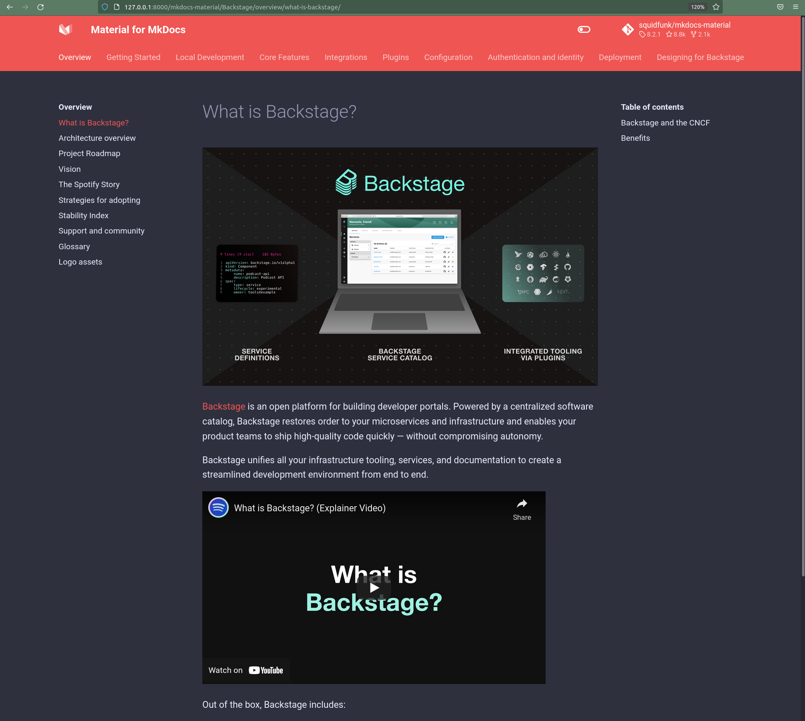

:warning: One person maintains this plugin in their spare time for free. :warning:

If you like this plugin and want me to continue maintaining it in my free time, please buy me a [beer 🍺](https://www.buymeacoffee.com/jdoiro) or sponser this plugin!

# mkdocs-multirepo-plugin

[](https://github.com/jdoiro3/mkdocs-multirepo-plugin/actions)
[](https://github.com/jdoiro3/mkdocs-multirepo-plugin/actions)
[](https://pypi.org/project/mkdocs-multirepo-plugin/)
[](https://www.repostatus.org/#active)


Build documentation in multiple repos into one site.

## Features

- **Distributed Documentation**: Keep docs close to the code but *findable* on one site.
- **Seperates Concerns**: Separate documentation from other files that go into building your mkdocs site (e.g., theme overrides).
- **Fast**: Documentation is imported asynchronously, using [asyncio](https://docs.python.org/3/library/asyncio.html).
- **Simple**: All configuration is done within the `plugins` or `nav` sections of your *mkdocs.yml* file.
- **Use in Production**: The plugin can be used in a CI/CD pipeline.

## OS Support


## Dependencies


> Newer versions of Git preferred.

## Setup

Install plugin using pip:

```
pip install mkdocs-multirepo-plugin
```

Next, add the plugin to your `mkdocs.yml`

```yaml
plugins:
  - multirepo
      # (optional) tells multirepo to cleanup the temporary directory after site is built.
      cleanup: true
      # if set the docs directory will not be removed when importing docs.
      # When using this with a nav section in an imported repo you must keep the
      # docs directory in the path (e.g., docs/path/to/file.md).
      keep_docs_dir: true
```

You'll now have 3 ways of importing docs:

- [plugins.multirepo.repos](#repos-config): Use this method if you don't have a `nav` section in the importees `mkdocs.yml` and want Mkdocs to generate navigation based on the directory structure. If there's a `nav` this will be ignored.
- [plugins.multirepo.nav_repos](#nav-repos-config): Use this if you have a `nav` section in the importees `mkdocs.yml` and want to refer to imported docs in the `nav` the same way as docs in the importees repo. This can be used alongside `!import` statements.
- [!import](#import-statement): Used to specify docs to import to a section in the `nav`. The imported repo needs to have a `mkdocs.yml` file with a `nav` section as well.

## Import Statement

The plugin introduces the *!import* statement in your config's *nav* section. You can now use the import statement to add a documentation section, where the docs are pulled from the source repo.

<details><summary><b>!import Statement Sections</b></summary>

  - **{url}**: Only *required* part of *!import* statement (e.g., `https://github.com/{user}/{repo name}`).
  - **branch={branch}**: Tells *multirepo* what branch (or tag) to use. Defaults to *master* if not supplied. This is the same argument used in `git clone` (see [here](https://git-scm.com/docs/git-clone#Documentation/git-clone.txt---branchltnamegt)).
  - **docs_dir={path}**: The path to the *docs* directory for the section. Defaults to *docs/\** (a glob) if not supplied.
  - **multi_docs={True | False}**: If set to *True* all *docs* directories will be imported (more info [here](#α-multiple-docs-directories-in-imported-repo-alpha)).
  - **config={filename}.yml**: Tells *multirepo* the name of the config file, containing configuration for the plugin. The default value is also `mkdocs.yml`. This config file can live within the docs directory *or* in the parent directory.
  - **extra_imports=["{filename | path | glob}"]**: Use this if you want to import additional directories or files along with the docs.
</details>

```yaml
nav:
  - Home: 'index.md'
  - MicroService: '!import {url}?branch={branch}&docs_dir={path}&multi_docs={True | False}&config={filename}.yml'
```

*MicroService mkdocs.yml (located within the docs directory or the parent directory)*
```yaml
edit_uri: /blob/master/

nav:
  - Home: index.md
```

> Things to Note:
>
> - If using *!import* in the *nav*, the imported repo must have a *mkdocs.yml* (or another filename with a *?config={filename}.yml*) file with a *nav* section located in either the *docs* directory or the root directory.
> - *nav* takes precedence over *repos* (see below).
> - *{path}* can also be a [glob](https://en.wikipedia.org/wiki/Glob_(programming)) (e.g., `docs/*`).

## Repos Config

If you'd prefer *MkDocs* to build the site nav based on the directory structure, you can define your other repos within the *plugins* section.

```yaml
plugins:
  - search
  - multirepo:
      # (optional) tells multirepo to cleanup the temporary directory after site is built.
      cleanup: true
      # if set the docs directory will not be removed when importing docs. When using this with a nav section in an imported repo
      # you must keep the docs directory in the path (e.g., docs/path/to/file.md).
      keep_docs_dir: true
      repos:
          # There will be a navigation section with this section name
        - section: Backstage
          # you can define the edit uri path
          import_url: 'https://github.com/backstage/backstage?edit_uri=/blob/master/'
        - section: Monorepo
          import_url: 'https://github.com/backstage/mkdocs-monorepo-plugin?edit_uri=/blob/master/'
        - section: 'Techdocs-cli'
          # note that the branch is still specified in the url
          import_url: 'https://github.com/backstage/techdocs-cli?branch=main&edit_uri=/blob/main/'
        - section: FastAPI
          import_url: 'https://github.com/tiangolo/fastapi?docs_dir=docs/en/docs/*'
        - section: Monorepo Multi Docs
          import_url: https://github.com/backstage/mkdocs-monorepo-plugin?multi_docs=True&docs_dir=sample-docs/*
        - section: 'Django REST'
          section_path: python # Put this under the python menu entry
          import_url: 'https://github.com/encode/django-rest-framework'
        - section: 'Cookiecutter Pypackage'
          section_path: python # Put this under the python menu entry
          import_url: 'https://github.com/zillionare/cookiecutter-pypackage'
        - section: 'Pydantic'
          section_path: python # Put this under the python menu entry
          import_url: 'https://github.com/samuelcolvin/pydantic?branch=main'
```

## Nav Repos Config

Once you're done configuring, run either `mkdocs serve` or `mkdocs build`. This will `import` the docs into a temporary directory and build the site.


## Additional Features

### α Multiple Docs Directories in Imported Repo (Alpha)

If an imported repo is a monorepo (i.e., has multiple *docs* directories), *multirepo* automatically includes them in the site when `multi_docs` is set to `True`.

Suppose *Microservice's* directory structure is this.

```
├───mkdocs.yml (required if nav section is defined)
├───README.md
├───project1
│   └───src
│   └───docs
│       └───assets
|         index.md
|         technical.md
├───project2
│   └───src
│   └───docs
│         index.md
```

By default, this directory turns into this.

```
├───mkdocs.yml (required if nav section is defined)
├───README.md
├───project1
│   └───assets
|     index.md
|     technical.md
├───project2
│     index.md
```

> Note:
> - If using the nav *!import* statement, make sure the nav paths reflect the new directory structure, which doesn't include *docs* directories.
> - *edit_urls* will still map to underlying markdown file based on the actual directory structure in the remote's repository.


### Use in CI/CD

If you want to use the plugin within Azure Pipelines or Github Actions, you'll need to define an access token.

#### Azure Pipelines

You'll need to define an `AccessToken` environment variable for the `mkdocs build` step. The access token should have access to `clone` all repos.

#### Github Actions

You'll need to define an `GithubAccessToken` environment variable for the `mkdocs build` step. The access token should have access to `clone` all repos. This can be a personal access token or one from a GitHub App.

#### Azure Pipeline Step Example

```yaml
- script: |
    source ./env/bin/activate
    mkdocs build
  env:
    AccessToken: $(System.AccessToken)
  displayName: 'Build MkDocs Site'
```

### β Development in Imported Repos (Beta)

For `mkdocs serve` to work properly in an imported repo (a repo that is imported in the parent site), *you will need to add the multirepo plugin within the imported repo as well as the parent repo*, including the following configuration.

> Notes:
> - You will also need to have `plugins` and `packages` the parent repo uses installed within your local `venv`.
> - See documentation on the [set](https://git-scm.com/docs/git-sparse-checkout#Documentation/git-sparse-checkout.txt-emsetem) git command for `sparse-checkout` if you are confused with what `paths` can contain.

```yml
plugins:
  multirepo:
    imported_repo: true
    url: https://github.com/squidfunk/mkdocs-material
    section_name: Backstage
    # dirs/files needed for building the site
    # any path in docs will be included. For example, index.md is the
    # homepage of the parent site
    paths: ["material/*", "mkdocs.yml", "docs/index.md"]
    custom_dir: material
    yml_file: mkdocs.yml # this can also be a relative path
    branch: master
```

Writers can now run `mkdocs serve` within their local repo, using the main site's configuration, custom theming and features. This means all development is distributed, without technical writers having to switch repos.

> Backstage with Material theme



## Contributing

You'll need to install [Poetry](https://python-poetry.org) and Git to contribute and run tests locally.

### Setup

> Assumes you have `poetry` installed and in your path

```~ poetry install & poetry shell```

### Running Tests

Tests were modeled off of [mkdocs-monorepo-plugin](https://github.com/backstage/mkdocs-monorepo-plugin/blob/master/docs/CONTRIBUTING.md). To run the test suite you'll need:

- Python
- Git
- Docker
- MkDocs

### Integration Testing

The command below will use Docker to run our test suites in numerous Python versions. It may take some time on first run, but should be very fast afterwards. When you're done, feel free to run `docker prune` to clear them from your local cache. We use the `slim` versions of the public `python` images from [Docker Hub](https://hub.docker.com).
```
$ ./__tests__/test.sh
```
For faster tests, you can opt to run in Python 3.7 rather than all supported Python versions:
```
$ PYTHON_37_ONLY=1 ./__tests__/test.sh
```

### Unit Testing

```
$ python[3] -m unittest tests.unittests
```
