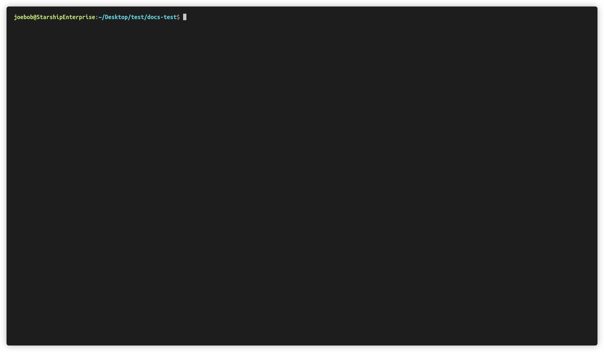

# mkdocs-multirepo-plugin

[](https://github.com/jdoiro3/mkdocs-multirepo-plugin/actions)
[](https://github.com/jdoiro3/mkdocs-multirepo-plugin/actions)
[](https://pypi.org/project/mkdocs-multirepo-plugin/)
[](https://www.repostatus.org/#active)


Build documentation in multiple repos into one site.

## Features

- **Distributed Documentation**: Keep docs close to the code but *findable* on one site.
- **Seperates Concerns**: Separate documentation from other files that go into building your mkdocs site (e.g., theme overrides).
- **Fast**: Documentation is imported asynchronously, using [asyncio](https://docs.python.org/3/library/asyncio.html).
- **Simple**: All configuration is done within the `plugins` or `nav` sections of your *mkdocs.yml* file.
- **Ready for Production**: The plugin can be used in a CI/CD pipeline.

## OS Support


## Setup

Install plugin using pip:

```
pip install mkdocs-multirepo-plugin
```

Next, add the plugin to your `mkdocs.yml`

```yaml
plugins:
  - multirepo
```

The plugin introduces the *!import* statement in your config's *nav* section. You can now use the import statement to add a documentation section, where the docs are pulled from the source repo.

```yaml
nav:
  - Home: 'index.md'
  - MicroService: '!import {url}?branch={branch}?docs_dir={path}?multi_docs={True | False}'
```

*MicroService mkdocs.yml (located within the docs directory)*
```yaml
edit_uri: /blob/master/

nav:
  - Home: index.md
```

### *!import* Statement Sections

- **{url}**: Only *required* part of *!import* statement (e.g., `https://github.com/{user}/{repo name}`).
- **?branch={branch}**: Tells *multirepo* what branch to use. Defaults to *master* if not supplied.
- **?docs_dir={path}**: The path to the *docs* directory for the section. Defaults to *docs/\** (a glob) if not supplied.
- **?multi_docs={True | False}**: If set to *True*, all *docs* directories will be imported (more info [here](#α-multiple-docs-directories-in-imported-repo-alpha)).

> Things to Note:
>
> - If using *!import* in the *nav*, the repo's docs folder must have a *mkdocs.yml* file with a *nav* section.
> - *nav* takes precedence over *repos* (see below).
> - *{path}* can also be a [glob](https://en.wikipedia.org/wiki/Glob_(programming)) (e.g., `docs/*`).


If you'd prefer *MkDocs* to build the site nav based on the directory structure, you can define your other repos within the *plugins* section.

> Note:
> Cleanup should be set to `false` when developing (i.e., when calling `mkdocs serve`). This will prevent importing repos multiple times with livereload.

```yaml
plugins:
  - search
  - multirepo:
      # (optional) tells multirepo to cleanup the temporary directory after site is built.
      cleanup: true
      repos:
        - section: Backstage
          import_url: 'https://github.com/backstage/backstage'
          # you can define the edit uri path
          edit_uri: /blob/master/
        - section: Monorepo
          import_url: 'https://github.com/backstage/mkdocs-monorepo-plugin'
          edit_uri: /blob/master/
        - section: 'Techdocs-cli'
          import_url: 'https://github.com/backstage/techdocs-cli?branch=main'
          edit_uri: /blob/main/
        - section: FastAPI
          import_url: 'https://github.com/tiangolo/fastapi'
          docs_dir: docs/en/docs/* # glob
        - section: Monorepo Multi Docs
          import_url: https://github.com/backstage/mkdocs-monorepo-plugin
          multi_docs: True
          docs_dir: sample-docs/* # glob
        - section: 'Django REST'
          import_url: 'https://github.com/encode/django-rest-framework'
        - section: 'Cookiecutter Pypackage'
          import_url: 'https://github.com/zillionare/cookiecutter-pypackage'
        - section: 'Pydantic'
          import_url: 'https://github.com/samuelcolvin/pydantic'
```

Once you're done configuring, run either `mkdocs serve` or `mkdocs build`. This will `import` the docs into a temporary directory and build the site.



## Additional Features

### α Multiple Docs Directories in Imported Repo (Alpha)

If an imported repo is a monorepo (i.e., has multiple *docs* directories), *multirepo* automatically includes them in the site when `multi_docs` is set to `True`.

Suppose *Microservice's* directory structure is this.

```
├───mkdocs.yml (required if nav section is defined)
├───README.md
├───project1
│   └───src
│   └───docs
│       └───assets
|         index.md
|         technical.md
├───project2
│   └───src
│   └───docs
│         index.md
```

By default, this directory turns into this.

```
├───mkdocs.yml (required if nav section is defined)
├───README.md
├───project1
│   └───assets
|     index.md
|     technical.md
├───project2
│     index.md
```

> Note: 
> - If using the nav *!import* statement, make sure the nav paths reflect the new directory structure, which doesn't include *docs* directories.
> - *edit_urls* will still map to underlying markdown file based on the actual directory structure in the remote's repository.


### Use in CI/CD

If you want to use the plugin within Azure Pipelines or Github Actions, you'll need to define an `AccessToken` environment variable for the `mkdocs build` step. The `AccessToken` should have access to `clone` all repos.

#### Azure Pipeline Step Example

```yaml
- script: |
    source ./env/bin/activate
    mkdocs build
  env:
    AccessToken: $(System.AccessToken)
  displayName: 'Build MkDocs Site'
```

### α Development in Imported Repos (Alpha)

For `mkdocs serve` to work properly in another repo (a repo that is imported into a main site), you will need to add the multirepo plugin within the *imported* repo, including the following configuration.

> Notes:
> - You will also need to have `plugins` the main repo (the repo what imports other repos) uses installed within your local `venv`.
> - See documentation on the [set](https://git-scm.com/docs/git-sparse-checkout#Documentation/git-sparse-checkout.txt-emsetem) git command for `sparse-checkout` if you are confused with what `dirs` can contain.

```yml
site_name: My Docs

plugins:
  multirepo:
    imported_repo: true
    url: [url to main repo]
    # directories and files needed for building the site
    dirs: ["overrides/*", "mkdocs.yml"]
    custom_dir: overrides # overrides directory
    yml_file: mkdocs.yml # this can also be a relative path
    branch: dev
```

Engineers can now run `mkdocs serve` within their local repo, using the main site's configuration, custom theming and features.


## Running Tests

Tests were modeled off of the similar well maintained package: [mkdocs-monorepo-plugin](https://github.com/backstage/mkdocs-monorepo-plugin/blob/master/docs/CONTRIBUTING.md). To run the test suite you'll need:

- Python
- Git
- Docker
- MkDocs

### Integration Testing

The command below will use Docker to run our test suites in numerous Python versions. It may take some time on first run, but should be very fast afterwards. When you're done, feel free to run `docker prune` to clear them from your local cache. We use the `slim` versions of the public `python` images from [Docker Hub](https://hub.docker.com).
```
$ ./__tests__/test.sh
```
For faster tests, you can opt to run in Python 3.7 rather than all supported Python versions:
```
$ PYTHON_37_ONLY=1 ./__tests__/test.sh
```

### Unit Testing

```
$ python -m unittest tests.unittests
```

